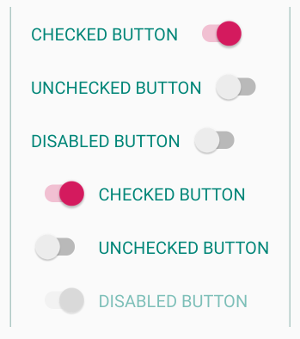
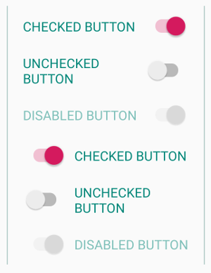

# SwitchButton - A Button with a Switch

And Android compound Widget combining a Button and a Switch into a convenient, easy-to-use single widget. You can easily set the position of the switch (start or end of the text) and the distance between the switch and text (padding).

## Screenshots

Buttons set to `WRAP_CONTENT` will have raged edges on the far side



Buttons set to `MATCH_PARENT` will align switches on the far side and break button text across multiple lines when necessary




## Add SwitchButton to your project

### JFrog Bintray

[  ](https://bintray.com/atlantic-omnibus/androidosslibs/switchbutton/_latestVersion)

### Jcenter

make sure you have `jcenter()` in your project level `build.gradle`, like so:
```Gradle
buildscript {
    repositories {
    
        /*...*/
        
        jcenter()
        
        /*...*/
    }
    
    /*...*/
} 
``` 

Then in your app/module level `build.gradle`:
    
```Gradle
dependencies {

    /*...*/
    
    implementation 'com.gitlab.atlanticomnibus:switchbutton:1.0.1'
    
    /*...*/
     
} 
```
## Example Usage

### XML

```XML
<com.atlanticomnibus.switchbutton.SwitchButton
      android:layout_width="wrap_content"
      android:layout_height="wrap_content"
      app:switchPosition="end"
      app:text="@string/button_text"
      app:toggleSwitchPadding="24dp"
      app:checked="true"
      app:enabled="true"/>
```

### java

```Java

import com.atlanticomnibus.switchbutton.SwitchButton;

/* ... */

Context mContext;

/* ... */

SwitchButton switchButton = new SwitchButton(mContext);
    switchButton.setSwitchPosition(SwitchButton.SWITCH_END);
    switchButton.setChecked(true);
    switchButton.setEnabled(true);
    switchButton.setButtonText(R.string.button_text);
    switchButton.setSwitchPadding(24);
    /*or*/
    switchButton.setSwitchPadding(TypedValue.COMPLEX_UNIT_DIP, 24);
    switchButton.setCheckedChangeListener(new SwitchButton.OnCheckedChangeListener() {
            @Override
            public void onCheckedChanged(SwitchButton switchButton, boolean isChecked) {
                    //Do stuff here
            }
    });
```


## Public methods

In alphabetical order

| Return type                          | Method                                                       | Description                                                  |
| ------------------------------------ | :----------------------------------------------------------- | :----------------------------------------------------------- |
| String                               | getButtonText()                                              | Gets the current button text as                              |
| SwitchButton.<br />OnCheckedChangeListener | getCheckedChangeListener()                                   | Returns a listener that listens for changes in checked state, if one is set |
| Switch                               | getSwitch()                                                  | Pass through the `Switch` component of the compound view, so it can be manipulated for any unexposed methods |
| int                                  | getSwitchPaddingDp()                                         | Get the `Switch` component's padding (its distance from the button text) in `TypedValue.COMPLEX_UNIT_DIP` |
| int                                  | getSwitchPaddingRaw()                                        | Returns the `Switch` component's padding (its distance from the button text) in raw pixels |
| int                                  | getSwitchPosition()                                          | Gets the position of the Switch component relative to the text (either left or right). <br />Evaluate against public constants `SWITCH_START` (0) and `SWITCH_END` (1)<br/>Example usage. To check whether the switch is at the start of the text: <br />`if(switchButton.getSwitchPosition() == SwitchButton.SWITCH_START) {...}` |
| TextView                             | getTextView()                                                | Pass through the `TextView` component of the compound view, so it can be manipulated for any unexposed methods |
| boolean                              | isChecked()                                                  | Returns the checked state of the `Switch` component          |
| boolean                              | isEnabled()                                                  | returns the enabled state of the widget                      |
| void                                 | setButtonText(int resId)                                     | Sets the `String` referenced by the supplied resId as button text |
| void                                 | setButtonText(String buttonText)                             | Sets the supplied `String` as the button text                |
| void                                 | setChecked(boolean checked)                                  | Set the checked state of the widget. Just like `this#toggle()` but here you explicitly set it `true` or `false` |
| void                                 | setCheckedChangeListener<br />(SwitchButton.OnCheckedChangeListener<br />checkedChangeListener) | Sets a listener to listen for changes in checked status changes |
| void                                 | setEnabled(boolean enabled)                                  | Sets the enabled state of the widget either `true` or `false`. This will set the enabled state of each component view, and the alpha value of the whole. Also makes every thing unclickable when disabled. |
| void                                 | setSwitchPadding(int padding)                                | Set The `Switch` component's padding (its distance from the button text) in `TypedValue.COMPLEX_UNIT_DIP` |
| void                                 | setSwitchPadding(int unit,                 int padding)      | Set The `Switch` component's padding (its distance from the button text) in any valid unit. |
| void                                 | setSwitchPosition(int switchPosition)                        | Allows you to dynamically set the position of the Switch component.<br /> Accepts a single integer parameter, that should use public constants `SWITCH_START` (0) and `SWITCH_END` (1). If `SWITCH_START` (or 0) is passed, it will position the Switch component to the start of the text, any other value will place it at the end of the text. No left or right absolute positioning for now.<br/>Example usage. To set the switch is at the end of the text:<br />`switchButton.setSwitchPosition(SwitchButton.SWITCH_END)` |
| void                                 | toggle()                                                     | Mimics the Switch class's Switch.toggle() method. OK, not really, but has the same result, calling `Switch.toggle()` on the `Switch` component view |


<br />

### Copyright, Licensing and Contributions

Copyright (c) 2019 Attila Orosz

SwitchButton is licensed under the MIT license (See license file).

The development of this library happens on [GitLab](https://gitlab.com/atlantic_omnibus/open-source/switch-button), which is an **open source** DevOps platform. The repository automatically gets pushed to GitHub as well for better discoverability. You are welcome to open any issues on GH, but if you want to contribute, please visit the [GitLab repo](https://gitlab.com/atlantic_omnibus/open-source/switch-button).